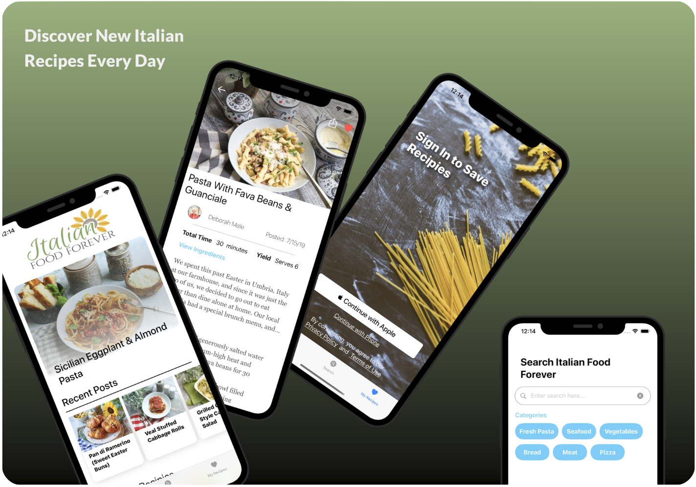

  

# Italian Food Forever App

Download on the [App Store](https://apps.apple.com/us/app/italian-food-forever/id1505015656?ls=1)

## Open Source & Copying

We ship the ItalianFoodForever on the App Store for free and provide its entire source code for free as well. In the spirit of openness, it is licensed under MPL-2.0 so that you can use my code in your app, if you choose.

However, please do not ship this app under your own account. Paid or free.

## Contribution Guidelines & License

License: [MPL-2.0](https://choosealicense.com/licenses/mpl-2.0/)

The IFF app doesn't require a CLA (Contributor License Agreement). The copyright belongs to all the individual contributors. Therefore we recommend that every contributor adds following line to the header of a file, if they changed it substantially:

`@copyright Copyright (c) <year>, <your name> (<your email address>)`

Please read the [Code of Conduct](CODE-OF-CONDUCT.md). This document offers some guidance to ensure contributors can cooperate effectively in a positive and inspiring atmosphere, and to explain how together we can strengthen and support each other.

## Start contributing

You can start by forking this repository and a creating pull request.

I have documented my current **todo** list using Github Issues.
